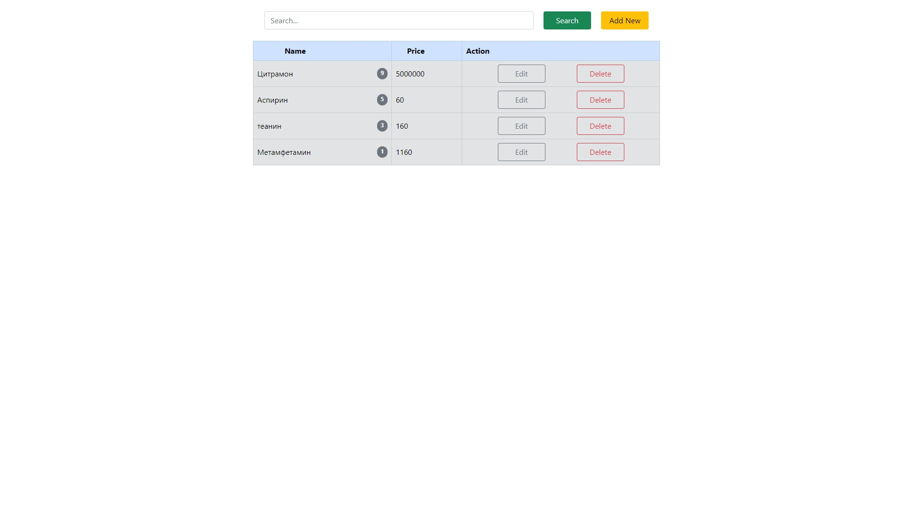

# Таблица продуктов

Данное приложение реализовано на чистом JavaScript. avascript CRUD функционал работы с данными в табличном виде, реализовал модальные окна, применил наследование, постарался оптимизировать кодовую базу.

[]

## Особенности

- Данное приложение реализовано на чистом JavaScript.
- В приложении использован CRUD функционал работы с данными в табличном виде.
- Применял наследование, оптимизировал кодовую базу.

## Реализован функционал

* Поиска по товарам.
* Добавление нового товара.
* Сортировка по наименованию и по цене.
* Редактирование товара.
* Удаление товара.