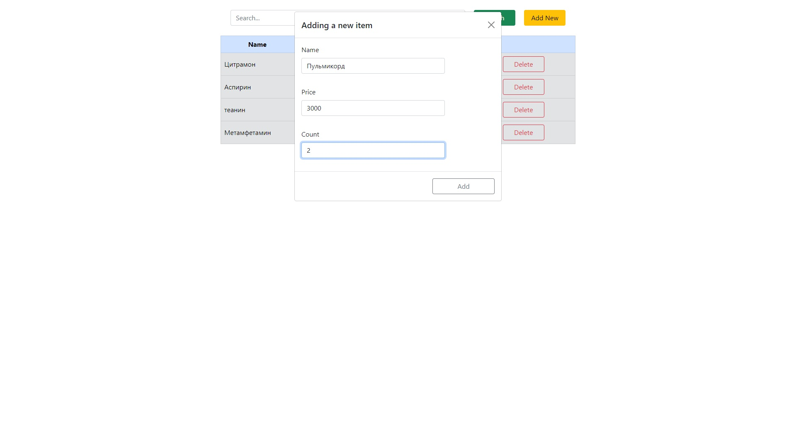

# Таблица продуктов

## Особенности

- Данное приложение реализовано на чистом JavaScript.
- В приложении использован CRUD функционал работы с данными в табличном виде.
- Применял наследование, оптимизировал кодовую базу.

## Реализован функционал

* Поиска по товарам.

* Добавление нового товара.

* Сортировка по наименованию и по цене.

* Редактирование товара.

* Удаление товара.

